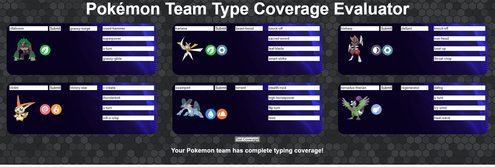
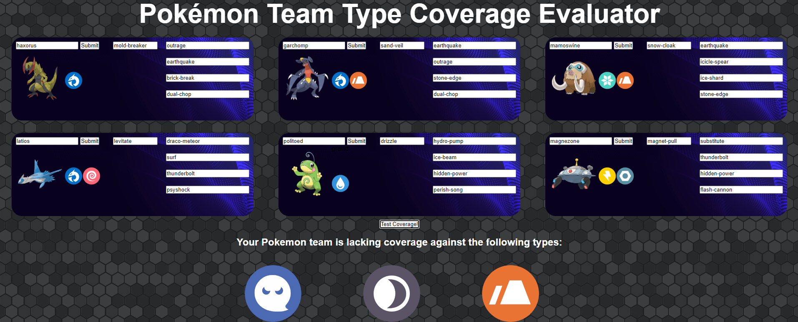

# Pokemon Team Builder

Description: a basic pokemon team builder that allows you to select 6 pokemon for your team and evaluate your team's type weaknesses using HTML, CSS, and JavaScript

# Technologies Used

- HTML5
- CSS3
- JavaScript
- PokeAPI

# Screenshots

- complete coverage

- incomplete coverage
# Getting Started
[Click here](https://pokemon-team-type-coverage-evaluator.netlify.app/) to try it out!

# Future Enhancements
- Evaluate move types and show what type of moves are lacking for attacking type coverage
- Allow addition of items
- Allow EV modification
- Show stats
- Assign roles to pokemon based on common roles in competitive
- Assign roles based on moves that is picked (e.g. Rapid Spinner, Set Ups / Dedicated Leads)
